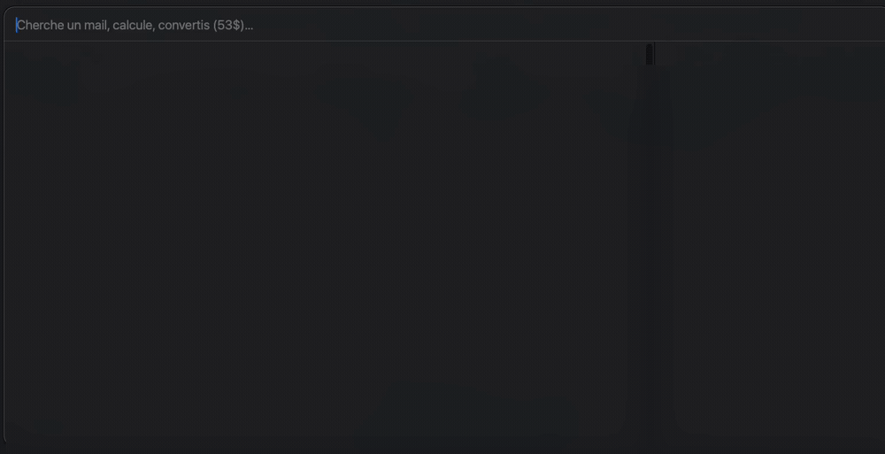

# Spotlight par le sens · Semantic Spotlight

  

> **FR** — Nostalgique du Spotlight de l'âge d'or du Mac (Tiger → Snow Leopard), celui qui était à la fois **cohérent** et **instantané**, je ne l'ai retrouvé ni dans sa version actuelle, ni dans les lanceurs tiers. Alors je me suis fait mon propre Spotlight — et je le partage.
>
> **EN** — Nostalgic for the Mac's golden-age Spotlight (Tiger → Snow Leopard) — the one that was both **coherent** and **instant** — I couldn't find that again in today's version, nor in third-party launchers. So I built my own Spotlight, and I'm sharing it.

Un lanceur **local** qui trouve par le **sens** : `Cmd + Space`, on tape, ça cherche dans les mails, documents, applications, réglages système et dossiers. Tout tourne sur la machine, rien ne part sur un serveur. / A **local** launcher that finds by **meaning**: `Cmd + Space`, type, and it searches your mail, documents, apps, system settings and folders. Everything runs on-device; nothing leaves the machine.

> ⚡ **Aussi réactif que Raycast, aussi puissant — voire plus — que Spotlight.** Réponses en ~15 ms, en direct pendant la frappe (le moteur reste chargé en mémoire), et une recherche par le *sens* que Spotlight n'a pas.
> ⚡ **As snappy as Raycast, as powerful as Spotlight — or more.** ~15 ms answers, live as you type (the engine stays warm in memory), plus *meaning-based* search that Spotlight doesn't have.



<sub>Démo du lanceur d'applications (résultats réels, non personnels). La recherche par le **sens** dans les mails et documents fonctionne pareil — non montrée ici pour garder des données privées privées. / App-launcher demo (real, non-personal results). Meaning-based search over mail & documents works the same way — not shown here to keep private data private.</sub>

---

## 🇫🇷 Français

### À quoi ça sert

Le Spotlight d'Apple cherche surtout par nom de fichier. Celui-ci cherche par **sens** : tu tapes une idée, il trouve le bon mail ou le bon document même si le mot exact n'y figure pas.

- **Recherche par le sens** dans les mails Apple Mail et les documents (« facture d'électricité » retrouve le bon PDF même sans ces mots exacts).
- **Lanceur d'applications** : le nom (français ou anglais) fait remonter l'app en n°1 — « pag » → Pages, « calc » → Calculatrice.
- **Lanceur de réglages système** : « wifi », « écran », « bluetooth » ouvrent directement le bon panneau des Réglages.
- **Dossiers** cherchables par nom, ouverts dans le Finder.
- **Aperçu latéral** : Quick Look interactif pour les fichiers (un STL tourne, un PDF se feuillette) et un panneau texte pour lire un mail sans ouvrir Mail.
- **Calcul et conversion** de devises directement dans la barre.
- Fenêtre native en verre dépoli, thèmes, onglets par catégorie, tri par date.

### Comment ça marche

Un moteur de recherche **hybride à 3 couches**, fusionnées par *Reciprocal Rank Fusion* (RRF) :

1. **Mot exact** — SQLite FTS5 (BM25) + trigrammes.
2. **Fautes de frappe** — `difflib` sur le vocabulaire réellement indexé (« brincks » → Brinks).
3. **Sens** — vecteurs [fastembed](https://github.com/qdrant/fastembed) (modèle MiniLM multilingue, 384 dimensions).

Un **daemon résident** (`serve.py`, port `8799` en local) garde le modèle et les index en mémoire et répond en ~15 ms — indispensable pour chercher en direct pendant la frappe. L'app native (`main.swift`, AppKit) affiche la fenêtre, capte le raccourci global et gère les aperçus.

### Installation — une commande

```bash
git clone https://github.com/vassi974/spotlight-sens.git
cd spotlight-sens
./install.command
```

`install.command` fait tout : venv Python dédié + dépendances, compilation de
l'app, services (LaunchAgents), premier index, lancement. Pour désinstaller :
`./uninstall.command`. Prérequis : macOS 13+, Python 3, outils Xcode
(`xcode-select --install`).

<details><summary>Installation manuelle (si tu préfères)</summary>

```bash
python3 -m venv venv && ./venv/bin/pip install fastembed numpy certifi segno
./venv/bin/python mail_index.py   # indexe les mails Apple Mail
./venv/bin/python docs_index.py   # indexe documents / apps / réglages / dossiers
./venv/bin/python serve.py        # moteur résident (port 8799)
bash app/build.sh && open app/SpotlightSens.app
```
</details>

### Vie privée

Les index (`*.sqlite`, `*.npy`), la configuration et les journaux **ne sont pas** dans ce dépôt (voir `.gitignore`) : ils contiennent le contenu réel de tes mails et documents. Seul le code est publié.

---

## 🇬🇧 English

### What it's for

Apple's Spotlight mostly matches file names. This one matches **meaning**: you type an idea and it finds the right email or document even when the exact words aren't in it.

- **Semantic search** across Apple Mail and your documents (“electricity bill” finds the right PDF even without those exact words).
- **App launcher**: typing a name (French or English) floats the app to #1 — “pag” → Pages, “calc” → Calculator.
- **System-settings launcher**: “wifi”, “display”, “bluetooth” open the matching Settings pane directly.
- **Folders** searchable by name, opened in Finder.
- **Side preview**: interactive Quick Look for files (an STL rotates, a PDF scrolls) and a text pane to read an email without opening Mail.
- **Calculator and currency conversion** right in the search bar.
- Native frosted-glass window, themes, category tabs, sort by date.

### How it works

A **3-layer hybrid** search engine, merged with *Reciprocal Rank Fusion* (RRF):

1. **Exact terms** — SQLite FTS5 (BM25) + trigrams.
2. **Typos** — `difflib` over the vocabulary actually indexed (“brincks” → Brinks).
3. **Meaning** — [fastembed](https://github.com/qdrant/fastembed) vectors (multilingual MiniLM, 384 dimensions).

A **resident daemon** (`serve.py`, local port `8799`) keeps the model and indexes warm and answers in ~15 ms — essential for live, as-you-type search. The native app (`main.swift`, AppKit) draws the window, captures the global hotkey and renders the previews.

### Setup — one command

```bash
git clone https://github.com/vassi974/spotlight-sens.git
cd spotlight-sens
./install.command
```

`install.command` does everything: a dedicated Python venv + dependencies, builds
the app, installs the background services (LaunchAgents), runs the first index and
launches. To remove it: `./uninstall.command`. Requirements: macOS 13+, Python 3,
Xcode command-line tools (`xcode-select --install`).

### Privacy

The indexes (`*.sqlite`, `*.npy`), the configuration and the logs are **not** in this repository (see `.gitignore`): they hold the real content of your mail and documents. Only the code is published. Everything runs locally.

---

## Fichiers · Files

| Fichier / File | Rôle / Role |
|---|---|
| `serve.py` | Moteur résident (HTTP local) : `/search`, `/mailbody`, `/ping`. / Resident engine. |
| `mail_index.py` | Indexe Apple Mail (`.emlx`). / Indexes Apple Mail. |
| `docs_index.py` | Indexe documents, apps, réglages, dossiers. / Indexes docs, apps, settings, folders. |
| `cherche.py` | Moteur 3 couches (CLI + daemon). / 3-layer engine (CLI + daemon). |
| `rate_update.py` | Taux USD/EUR. / USD/EUR rate. |
| `import_theme.py` | Importe un thème Linux (base16, KDE, Xresources, iTerm). / Imports a Linux theme. |
| `app/main.swift` | Application native AppKit. / Native AppKit app. |
| `app/build.sh` | Compile `SpotlightSens.app`. / Builds the app. |
| `themes/` | Thèmes (Nord, Dracula, Catppuccin, Gruvbox…). / Themes. |

## Licence · License

[PolyForm Noncommercial 1.0.0](LICENSE) — libre en usage non commercial. / free for noncommercial use.
